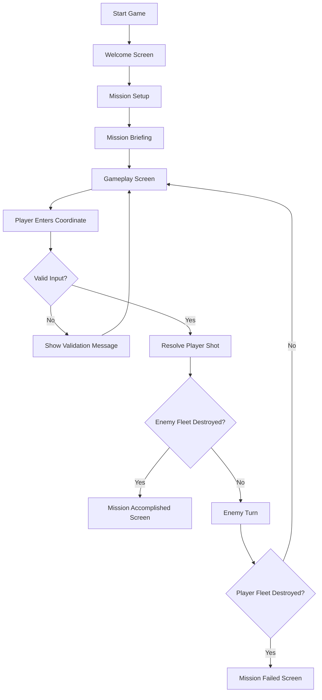
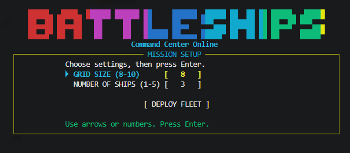
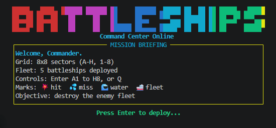
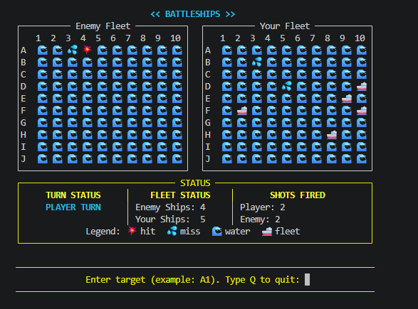
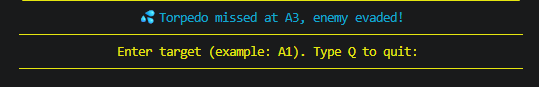
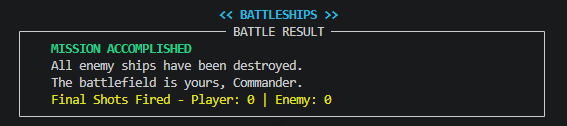
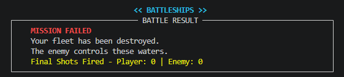

<div align="center">

<pre>
██████   █████  ████████ ████████ ██      ███████ ███████ ██   ██ ██ ██████  ███████
██   ██ ██   ██    ██       ██    ██      ██      ██      ██   ██ ██ ██   ██ ██
██████  ███████    ██       ██    ██      █████   ███████ ███████ ██ ██████  ███████
██   ██ ██   ██    ██       ██    ██      ██           ██ ██   ██ ██ ██           ██
██████  ██   ██    ██       ██    ███████ ███████ ███████ ██   ██ ██ ██      ███████
</pre>

### Command the Seas. Hunt the enemy. Sink the fleet.

<p><em>A Python terminal battleship experience built for tactical play, clean UI, and arcade-style feedback.</em></p>

<pre>
⠀⠀⠀⠀⠀⠀⠀⠀⠀⠀⠀⠀⠀⠀⠀⠀⠀⠀⠀⠀⠀⠀⠀⠀⠀⠀⠀⠀⠀⠀⠀⠀⠀⠀⠀⠀⠀⠀⡄⠀⠀⠀⠀⠀⠀⠀⠀⠀⠀⠀⠀⠀⠀⠀⠀⠀⠀⠀⠀⠀⠀⠀⠀⠀⠀⠀⠀⠀⠀⠀⠀⠀⠀⠀⠀⠀⠀⠀⠀⠀⠀⠀⠀⠀⠀⠀⠀⠀
⠀⠀⠀⠀⠀⠀⠀⠀⠀⠀⠀⠀⠀⠀⠀⠀⠀⠀⠀⠀⠀⠀⠀⠀⠀⠀⠀⠀⠀⠀⠀⠀⠀⠀⠀⠀⠀⢠⡃⠀⠀⠀⠀⠀⠀⠀⠀⠀⠀⠀⠀⠀⠀⠀⠀⠀⠀⠀⠀⠀⠀⠀⠀⠀⠀⠀⠀⠀⠀⠀⠀⠀⠀⠀⠀⠀⠀⠀⠀⠀⠀⠀⠀⠀⠀⠀⠀⠀
⠀⠀⠀⠀⠀⠀⠀⠀⠀⠀⠀⠀⠀⠀⠀⠀⠀⠀⠀⠀⠀⠀⠀⠀⠀⠀⠀⠀⠀⠀⠀⠀⠀⠀⠀⠀⠀⠀⡇⠀⢀⣀⠂⠄⠀⠀⠀⠀⠀⠀⠀⠀⠀⠀⠀⠀⠀⠀⠀⠀⠀⠀⠀⠀⠀⠀⠀⠀⠀⠀⠀⠀⠀⠀⠀⠀⠀⠀⠀⠀⠀⠀⠀⠀⠀⠀⠀⠀
⠀⠀⠀⠀⠀⠀⠀⠀⠀⠀⠀⠀⠀⠀⠀⠀⠀⠀⠀⠀⠀⠀⠀⠀⠀⠀⠀⠀⠀⠀⠀⠀⠀⠀⠀⠀⠀⠀⠦⡠⡄⢈⣣⠡⡠⡀⠀⠀⠀⠀⠀⠀⠀⠀⠀⠀⠀⠀⠀⠀⠀⠀⠀⠀⠀⠀⠀⠀⠀⠀⠀⠀⠀⠀⠀⠀⠀⠀⠀⠀⠀⠀⠀⠀⠀⠀⠀⠀
⠀⠀⠀⠀⠀⠀⠀⠀⠀⠀⠀⠀⠀⠀⠀⠀⠀⠀⠀⠀⠀⠀⠀⠀⠀⠀⠀⠀⠀⠂⠀⠀⠀⠀⠀⠀⠀⠀⠀⠀⡄⢊⠔⠔⠄⡀⠀⠀⠀⠀⠀⠀⠀⠀⠀⠀⠀⠀⠀⠀⠀⠀⠀⠀⠀⠀⠀⠀⠀⠀⠀⠀⠀⠀⠀⠀⠀⠀⠀⠀⠀⠀⠀⠀⠀⠀⠀⠀
⠀⠀⠀⠀⠀⠀⠀⠀⠀⠀⠀⠀⠀⠀⠀⠀⠀⠀⠀⠀⠀⠀⠀⠀⠀⠀⠀⠀⠀⠐⠀⠀⠀⠀⠀⠀⠀⠀⠠⠀⡪⡪⠣⢑⠨⠀⢖⡸⠀⠀⢀⢀⠀⡁⠀⠀⠀⠀⠀⠀⠀⠀⠀⠀⠀⠀⠀⠀⠀⠀⠀⠀⠀⠀⠀⠀⠀⠀⠀⠀⠀⠀⠀⠀⠀⠀⠀⠀
⠀⠀⠀⠀⠀⠀⠀⠀⠀⠀⠀⠀⠀⠀⠀⠀⠀⠀⠀⠀⠀⠀⠀⠀⠀⠀⠀⠀⢠⡀⢁⣀⡤⡤⣤⢤⡄⠀⠀⢸⢪⡲⡌⡢⠨⢎⢝⠬⡤⠤⡔⠦⡀⢄⠀⢠⢀⢀⠀⠀⠀⠀⠀⠀⠀⠀⠀⠀⠀⠀⠀⠀⠀⠀⠀⠀⠀⠀⠀⠀⠀⠀⠀⠀⠀⠀⠀⠀
⠀⠀⠀⠀⠀⠀⠀⠀⠀⠀⠀⠀⠀⠀⠀⠀⠀⠀⠀⠀⠀⠀⢀⢠⡐⢴⠱⢀⡘⡵⡹⣕⡽⣹⢼⡱⡕⡝⠽⢕⣓⢯⡻⡪⠏⡚⠸⢙⠪⠯⡚⠝⠈⠡⡤⣈⡪⣣⠮⠀⠀⠀⠀⠠⡠⡀⣀⠀⠀⠀⠀⠀⠀⠀⠀⠀⠀⠀⠀⠀⠀⠀⠀⠀⠀⠀⠀⠀
⠀⠀⠀⠀⡀⠀⠀⠀⠀⠀⠠⠠⠄⠤⠠⡠⡰⡀⠀⠀⢠⢦⡨⣕⢮⢗⢤⢧⢯⢬⠽⠼⠵⠳⠵⠣⠭⠮⠫⠲⠪⠃⡂⢅⢑⠨⡈⡢⠨⢂⢂⠢⠤⠠⡣⠵⠔⠤⠔⠧⠤⠤⠠⠬⠮⠮⠦⠡⠤⠤⠤⠤⠤⠠⠠⡠⡠⣠⡠⡠⣠⢠⠤⠀⠀⠀⠀⠀
⠀⠀⠀⠀⣬⣜⣤⢤⡤⣢⢥⣢⣤⡬⣝⣞⡮⣤⢤⡥⣳⣕⣕⣧⣳⢝⣮⣺⣪⡡⣂⣌⣂⣅⢅⣅⢕⣈⢀⡀⣀⡠⣂⣅⣂⣅⣂⡢⣑⣐⢄⢅⣊⢔⣐⢬⢬⢬⢬⡢⡥⡪⡬⡲⡳⣲⡪⡮⡲⣕⢏⣏⢏⢯⡫⣺⢪⡺⣜⣝⠗⠉⠀⠀⠀⠀⠀⠀
⠀⠀⠀⠀⠈⢞⡾⡽⡾⣽⣺⣳⣳⢯⣟⢾⣝⣗⡯⡯⣗⡯⣞⢷⢽⢽⣺⢞⢮⢮⡣⡧⡳⣪⢳⢕⠇⡎⡢⢣⡺⣜⢕⢮⡪⡲⡵⣹⢪⢎⡗⡽⣸⢪⡺⣪⢳⣹⣪⢮⡳⣝⢮⢯⢞⡮⣞⢮⡳⣳⢳⢕⢏⢧⡫⡮⡳⡹⠈⠀⠀⠀⠀⠀⠀⠀⠀⠀
⠀⠀⠀⠂⠠⠠⠛⠛⠛⢋⠓⠛⡋⢛⠚⠛⢓⠛⢛⠛⢛⠛⢛⠛⡛⢛⠛⡛⢛⠫⢛⠛⡛⢛⠛⡛⡛⢛⢛⢛⠛⢝⢛⢛⢛⢛⢛⢛⢛⢛⢛⠛⡛⢛⠛⡛⢛⠝⡚⡛⢛⠛⡛⢛⠫⠛⠝⠫⠛⠝⠛⠛⢛⠙⠫⠛⡑⢐⠐⡐⠄⠂⠔⠀⠂⠐⠀⠀
⠀⠀⠀⠀⠀⠀⠀⠀⠀⠀⠀⠀⠀⠀⠀⠈⠀⠀⠀⠀⠀⠀⠀⠀⠀⠀⠀⠀⠀⠀⠀⠀⠀⠀⠀⠀⠀⠀⠀⠀⠈⠀⠀⠀⠀⠀⠀⠀⠀⠀⠀⠀⠀⠀⠀⠀⠀⠀⠀⠀⠀⠀⠀⠀⠀⠀⠈⠀⠀⠐⠈⠀⠀⠀⠀⠀⠀⠀⠀⠀⠀⠀⠀⠀⠀⠀⠀⠀
</pre>

</div>

---

# Table of Contents

1. [Project Overview](#project-overview)
2. [UX Design](#ux-design)
   - [Project Goals](#project-goals)
   - [Target Users](#target-users)
   - [User Stories](#user-stories)
   - [Design Choices](#design-choices)
3. [Game Flow](#game-flow)
4. [Features](#features)
   - [Existing Features](#existing-features)
   - [Welcome Screen](#welcome-screen)
   - [Mission Setup Screen](#mission-setup-screen)
   - [Mission Briefing Screen](#mission-briefing-screen)
   - [Gameplay Screen](#gameplay-screen)
   - [Turn Feedback Messages](#turn-feedback-messages)
   - [End Game Result Screens](#end-game-result-screens)
   - [Input Validation](#input-validation)
   - [Enemy Turn Logic](#enemy-turn-logic)
   - [Developer Testing Tools](#developer-testing-tools)
   - [Future Features](#future-features)
5. [Technologies Used](#technologies-used)
6. [Project Structure](#project-structure)
7. [How to Play](#how-to-play)
   - [Step-by-Step Instructions](#step-by-step-instructions)
   - [Controls Reference](#controls-reference)
   - [Game Symbols Guide](#game-symbols-guide)
8. [Testing](#testing)
   - [Manual Testing](#manual-testing)
   - [Validator Testing](#validator-testing)
   - [Bugs Fixed](#bugs-fixed)
   - [Remaining Bugs](#remaining-bugs)
9. [Deployment](#deployment)
   - [Code Institute Deployment](#code-institute-deployment)
   - [How to Fork the Repository](#how-to-fork-the-repository)
   - [How to Clone the Repository](#how-to-clone-the-repository)
10. [Credits](#credits)
    - [Content](#content)
    - [Code Inspiration](#code-inspiration)
    - [Acknowledgements](#acknowledgements)

---

# Project Overview

**Battleships** is a terminal-based Python strategy game inspired by the classic naval combat format, where the player must locate and destroy all enemy ships before the enemy destroys the player’s fleet.

This project was designed as a complete command-line game experience rather than a basic text-only prototype. The aim was not only to make the game functional, but also to create a more polished and engaging terminal interface with a clear game flow, strong visual structure, responsive feedback, and a cinematic arcade-style presentation that remains suitable for the Code Institute deployment terminal.

The project takes the familiar Battleships concept and presents it through a structured multi-screen player journey:

- a welcome screen that introduces the game
- a mission setup screen where the user selects the battlefield size and fleet size
- a mission briefing screen that explains the rules and symbols
- a live gameplay screen with two tactical boards shown side by side
- a status section that continuously reports turn information, ships remaining, and shot counts
- turn-by-turn feedback after each player and enemy action
- dedicated end-game result screens for mission success and mission failure

The game was intentionally built around readability and usability. Because terminal-based applications can easily become confusing or visually cluttered, special care was taken to structure each screen in a way that feels organised, easy to scan, and beginner-friendly. Important information is grouped into framed sections, feedback is shown clearly after every action, and controls are explained in plain language.

A major design goal of the project was to ensure that the gameplay experience still feels dynamic even within the limitations of a terminal interface. For this reason, the game includes:

- stylised title presentation
- framed tactical boards
- colour-coded feedback messages
- a clearly separated status panel
- sequential turn pacing
- dedicated mission result screens

The project also focuses on controlled scope. Instead of trying to simulate the full traditional Battleships ruleset with complex multi-cell ship placement and advanced AI, the game concentrates on delivering a clean, stable, and enjoyable battle loop with strong presentation and reliable input handling. This makes the experience easier to understand while still offering strategy, suspense, and replayability.

In practical terms, the player chooses a grid size between **8x8 and 10x10**, chooses a fleet size between **1 and 5 ships**, and then begins the battle. The player attacks by entering coordinates such as `A1`, `B7`, or `H8`. After each player move, the enemy automatically responds with a valid random strike that never repeats a previous attempt. The match continues until one fleet is completely destroyed.

This project also includes hidden developer testing tools which were used during development to speed up screenshot capture and special-state testing. These tools are intentionally disabled in normal gameplay so that the deployed version remains fair, clean, and assessment-safe.

Overall, this project was built to demonstrate:

- Python programming fundamentals
- terminal UI design
- input validation
- game state management
- user-focused feedback design
- structured testing and deployment readiness

---

# UX Design

## Project Goals

The primary goal of this project was to create a terminal game that feels complete, readable, and enjoyable from start to finish. Rather than showing only the core logic, the project was designed to guide the user through a clear sequence of screens and interactions that make the experience feel more like a real game product.

The project goals were:

### 1. Build a fully playable terminal game

The project needed to be more than a code demonstration. The user should be able to:

- start the game easily
- understand what to do
- interact with the system without confusion
- play until a clear win or loss outcome occurs

### 2. Keep the interface suitable for deployment

Because the final game is displayed in the Code Institute terminal deployment template, the layout had to be carefully designed so that:

- important content remains visible
- the player does not need to scroll through normal gameplay
- framed UI sections remain readable
- boards and prompts stay aligned within a narrow terminal space

### 3. Make the game easy for first-time users

Terminal games can feel intimidating for users who are unfamiliar with CLI interfaces. To reduce this barrier, the project includes:

- a welcome screen
- clear setup instructions
- a mission briefing before gameplay
- visible board labels
- input examples
- explanatory feedback after every action

### 4. Improve the classic Battleships presentation

The traditional idea of Battleships is strong, but terminal versions can often feel too plain. This project aimed to improve the experience by including:

- stylised title art
- colour-coded interface elements
- framed battle panels
- tactical status reporting
- mission-style wording
- dramatic success and failure screens

### 5. Provide meaningful gameplay feedback

The player should never feel lost after entering a move. The game therefore reports:

- whether the shot was a hit or miss
- the coordinate targeted
- enemy response messages
- changing fleet counts
- total shot counts
- end result summaries

### 6. Support clean testing and documentation

The project also needed to support:

- screenshot capture for the README
- manual testing of special states
- predictable structure for explanation and validation
- assessment-friendly presentation

## Target Users

This project is aimed at several types of users.

### Casual Strategy Players

Users who enjoy classic turn-based games can play a simplified naval combat experience in the browser through the terminal deployment environment.

### Beginner-Friendly Terminal Users

Some users may not have much experience with command-line games. The game was designed so that even a first-time player can understand what to do with minimal confusion.

### Assessors and Reviewers

The project also needs to communicate clearly to an assessor. For that reason, the layout, feedback, structure, and documentation are all important. The game should show not only working logic, but also careful attention to usability and presentation.

### Returning Players

Users who play more than once should be able to quickly:

- change grid size
- change the number of ships
- start a new match
- enjoy a slightly different battle due to random ship placement and enemy targeting

## User Stories

### First-Time User Stories

- As a first-time user, I want a clear opening screen so that the game feels welcoming and intentional.
- As a first-time user, I want setup instructions so that I know how to choose my options.
- As a first-time user, I want to understand the game rules before the battle starts.
- As a first-time user, I want visible coordinate labels on the boards so that I can target correctly.
- As a first-time user, I want input examples so that I know what format to type.
- As a first-time user, I want the game to tell me whether my move was a hit or miss.
- As a first-time user, I want clear messages when I type invalid input.
- As a first-time user, I want a final result screen so that I clearly know whether I won or lost.

### Returning User Stories

- As a returning player, I want to start a new game quickly.
- As a returning player, I want to change the grid size and fleet size for variety.
- As a returning player, I want the battle layout to remain readable every time I play.
- As a returning player, I want feedback to appear quickly and clearly after each action.
- As a returning player, I want the game to feel polished enough that replaying it is enjoyable.

### Developer / Project Owner Stories

- As the developer, I want the layout to remain stable in the deployment terminal.
- As the developer, I want clear screen sections so the interface does not feel messy.
- As the developer, I want controlled developer cheat tools for fast testing.
- As the developer, I want the README screenshots to match the real deployed interface.
- As the developer, I want the game structure to be easy to explain and assess.

## Design Choices

### Visual Theme

The project uses a **naval command / tactical mission** theme rather than a plain utility-style terminal layout. This theme was chosen because it helps the user feel that they are controlling a fleet rather than simply running a script.

Terms such as:

- Mission Setup
- Mission Briefing
- Enemy Fleet
- Your Fleet
- Mission Accomplished
- Mission Failed

help create a more immersive and memorable experience.

### Layout Strategy

The layout is divided into clearly separated interface blocks:

- title area
- setup / briefing panel
- gameplay boards
- status panel
- input area
- result screen

This makes the interface easier to scan and reduces cognitive overload. Instead of mixing all information into continuous text, the user is guided through neatly separated phases.

### Colour Usage

Colour is used purposefully rather than randomly.

- **Cyan** is used for headings and player-side emphasis.
- **Yellow** is used for panel borders, dividers, and important UI framing.
- **Green** is used for positive actions and mission success.
- **Red / Magenta** is used for warnings, danger, enemy alerts, and defeat-related emphasis.
- **White** is used for standard readable content.

This colour system improves clarity while also giving the game a stronger visual identity.

### Framed Terminal Panels

Framed panels were chosen to:

- separate sections visually
- make the interface feel organised
- improve readability in the terminal
- create a premium arcade-console feel

Without these panels, the game would still function, but it would feel more like raw output than a designed product.

### Board Layout

The battle screen uses two boards:

- **Enemy Fleet** on the left
- **Your Fleet** on the right

This is the most intuitive layout because it lets the player compare both battle zones at a glance. It also matches the logic of the game:

- the left board is where the player attacks
- the right board shows the player’s own fleet state

### Symbol Design

Emoji symbols were chosen because they communicate meaning faster than plain letters.

- `🌊` represents water
- `💦` represents a missed strike
- `💥` represents a successful hit
- `🚢` represents a visible player ship

This makes the board easier to read visually, especially for beginners.

### Input Prompt Design

The input area was written in a more instructional style rather than a minimal prompt. Instead of only saying something vague, the game explicitly tells the user:

- what format to enter
- gives an example such as `A1`
- explains that `Q` quits the game

This reduces user mistakes and improves confidence.

### UX Priorities

The most important UX priorities in this project were:

1. clarity  
2. readability  
3. stable layout  
4. understandable rules  
5. visible feedback  
6. smooth deployment fit

---

# Game Flow

The game was designed as a structured player journey rather than a single continuous screen. Each phase has a clear purpose and prepares the player for the next one.

## Flow Summary

1. The player launches the game.
2. The welcome screen appears.
3. The player selects grid size and number of ships.
4. The mission briefing explains rules and symbols.
5. The battle screen appears with enemy and player boards.
6. The player enters a target coordinate.
7. The game validates the input.
8. The shot is resolved as hit or miss.
9. The enemy takes a turn.
10. The status panel updates continuously.
11. The cycle repeats until one fleet is destroyed.
12. A final result screen announces success or failure.

## Flow Diagram



## Detailed Phase Explanation

### 1. Welcome Screen

The game begins with title art and a clean command-center presentation. This immediately establishes the theme and gives the project a stronger identity than a plain terminal script.

### 2. Mission Setup

Before the battle begins, the user selects:

- grid size
- number of ships

This setup stage gives the player control over the battle scale and helps make the game more replayable.

### 3. Mission Briefing

The mission briefing acts like a preparation screen. It explains:

- the size of the grid
- the number of deployed ships
- the valid control format
- the meaning of symbols
- the mission objective

This step is especially important for new users.

### 4. Gameplay Loop

Once the battle starts, the player enters target coordinates to attack the enemy fleet. The game then:

- checks the input
- checks whether the target was already used
- resolves the strike
- updates the board
- shows feedback
- triggers the enemy turn
- updates status values

### 5. End State

When one fleet is fully destroyed, the game exits the loop and displays a dedicated result screen summarising the outcome.

---

# Features

## Existing Features

The project currently includes the following gameplay and interface features:

- stylised welcome screen
- mission setup panel
- mission briefing panel
- grid size selection from 8 to 10
- ship count selection from 1 to 5
- side-by-side gameplay boards
- row and column coordinate system
- visible player fleet
- hidden enemy fleet until hit
- turn-based battle loop
- hit and miss detection
- random enemy targeting
- repeated-target prevention
- live status panel
- battle feedback messages
- mission accomplished screen
- mission failed screen
- hidden developer testing tools

## Welcome Screen

The welcome screen is the player’s first contact with the game. Its purpose is not only decorative, but functional. It introduces the theme, establishes the tone, and makes the project feel like a complete product.

The welcome screen includes:

- title art or fallback title text, depending on terminal width
- command-center subtitle
- transition into the setup phase

### UX Purpose

This screen improves first impressions and gives the project a stronger identity. Without it, the player would enter directly into setup and lose part of the polished experience.

### Screenshot



## Mission Setup Screen

The mission setup screen allows the player to configure the battle before it begins.

### Available Setup Options

#### Grid Size

The player can choose a battlefield size from:

- 8
- 9
- 10

This affects both boards and changes the battle space.

#### Number of Ships

The player can choose the total number of ships from:

- 1
- 2
- 3
- 4
- 5

This changes battle length and difficulty.

#### Navigation Controls

The player can use:

- Up Arrow to move up
- Down Arrow to move down
- Left Arrow to reduce a value
- Right Arrow to increase a value
- Number keys to type values directly
- Backspace to remove typed input
- Enter to confirm and continue

### UX Purpose

This screen gives the user control, improves replay value, and makes the game feel interactive before combat even begins.

### Screenshot


## Mission Briefing Screen

The mission briefing screen acts as a short pre-battle tutorial.

It explains:

- current grid size
- number of deployed ships
- control format
- board symbols
- objective of the mission

### Example Information Given

- grid range such as `A-H` or `A-J`
- number range such as `1-8` or `1-10`
- valid target examples like `A1`
- the meaning of `Q`
- the meaning of the board icons

### UX Purpose

This is important because it lowers the learning curve. It helps new users understand the battle before the first move and reduces the chance of confusion.

### Screenshot



## Gameplay Screen

The gameplay screen is the core interface of the project.

It contains:

- the game title
- the enemy fleet board
- the player fleet board
- a status panel
- a feedback message line
- a dedicated target input area
- permanent divider lines for clarity

### Enemy Fleet Board

The enemy board shows what the player knows about the enemy position:

- water for untouched cells
- miss markers where shots failed
- hit markers where enemy ships were found

Enemy ships are hidden unless hit.

### Your Fleet Board

The player board shows:

- water
- the player’s visible ships
- enemy misses
- enemy hits

This lets the player monitor both attack progress and defence status.

### Coordinate Labels

Both boards use:

- row letters (`A`, `B`, `C`, etc.)
- column numbers (`1`, `2`, `3`, etc.)

This makes targeting intuitive and easy to understand.

### UX Purpose

The gameplay screen was designed to keep all essential battle information visible at once. The player should not need to guess:

- where to attack
- whose turn it is
- how many ships remain
- what the last action did

### Screenshot



## Status Panel

The status panel is placed directly below the boards and groups the most important live battle information into three sections.

### Turn Status

This shows whether it is currently:

- **PLAYER TURN**
- **ENEMY TURN**

### Fleet Status

This shows how many ships remain for:

- the enemy fleet
- the player fleet

### Shots Fired

This shows the total number of shots taken by:

- the player
- the enemy

### Legend

The status panel also includes a visual legend for:

- hit
- miss
- water
- fleet ship

### UX Purpose

The status panel prevents the user from needing to remember battle numbers mentally. It keeps the interface tactical and readable.

## Turn Feedback Messages

After each move, the game displays a dedicated battle feedback message.

Examples include:

- player hit message
- player miss message
- enemy attack result
- warning before enemy turn

### Why This Matters

Turn feedback keeps the game from feeling silent or mechanical. It adds pacing and helps the user understand what changed after an action.

### Screenshot



## End Game Result Screens

Once either fleet is fully destroyed, the game shows a dedicated result screen instead of abruptly ending.

### Mission Accomplished Screen

Shown when all enemy ships are destroyed.

It confirms:

- mission success
- that the battlefield is secured
- final shot statistics

### Mission Failed Screen

Shown when all player ships are destroyed.

It confirms:

- mission failure
- that the enemy has taken control
- final shot statistics

### UX Purpose

The result screen gives proper closure to the battle and makes the ending feel deliberate and complete.

### Screenshots





## Input Validation

Strong validation is one of the key gameplay quality features in this project.

The game checks for:

- empty or incomplete input
- coordinates in the wrong format
- non-numeric columns
- coordinates outside the active grid
- repeated target attempts

### Examples of Invalid Input

- `A`
- `11`
- `Z9`
- `AA`
- already-used coordinates

### Why This Matters

Without validation, the game could:

- accept broken input
- confuse the player
- damage the game state
- feel unreliable

Instead, the game provides clear messages and keeps the user on track.

## Enemy Turn Logic

The enemy uses random targeting, but with important safeguards.

### Behaviour

- selects a random coordinate
- checks whether that coordinate has already been used
- retries until a fresh target is found
- records the shot result
- updates the player board accordingly

### Benefit

This keeps enemy turns valid and prevents duplicate attacks on the same square.

The logic is intentionally simple, which suits the scope of the project and keeps the gameplay fair and understandable.

## Hidden Developer Testing Tools

During development, hidden testing tools were added to speed up screenshot capture and special-state testing.

These tools are intentionally disabled in normal gameplay.

### Why They Are Disabled

Developer commands are turned off in the final version because:

- normal players should not accidentally activate cheats
- the deployed assessment version should represent real gameplay
- testing shortcuts should not affect the fairness of the game
- the final user experience should remain clean and consistent

### How to Enable Developer Mode

Open `run.py`.

Find this line inside the `BattleshipGame.__init__()` method:

```python
self.dev_mode = False
```

Replace it with:

```python
self.dev_mode = True
```

Save the file and run the game again.

### Where to Type the Cheat Codes

After developer mode is enabled, launch the game normally and continue until you reach the main **gameplay screen**.

Type the cheat code in the same place where you would normally enter a target coordinate such as:

- `A1`
- `B7`
- `H8`

In other words, enter the cheat code in the **target input prompt** shown during battle.

Example prompt:

```text
Enter target (example: A1). Type Q to quit:
```

Instead of entering a normal coordinate, type one of the developer commands below and press **Enter**.

### Available Developer Commands

#### `/WIN`

Forces an instant player victory.

**Where to use it:**  
Type `/WIN` into the gameplay target input prompt and press **Enter**.

**What happens:**  

- all enemy ships are removed immediately
- the game ends with the **Mission Accomplished** screen

**Best used for:**  

- capturing the victory screenshot
- testing the final success state
- checking the success result panel

---

#### `/LOSE`

Forces an instant player defeat.

**Where to use it:**  
Type `/LOSE` into the gameplay target input prompt and press **Enter**.

**What happens:**  

- all player ships are removed immediately
- the game ends with the **Mission Failed** screen

**Best used for:**  

- capturing the defeat screenshot
- testing the final failure state
- checking the failure result panel

---

#### `/PHIT`

Forces a successful player hit on one remaining enemy ship.

**Where to use it:**  
Type `/PHIT` into the gameplay target input prompt and press **Enter**.

**What happens:**  

- one enemy ship is destroyed
- the enemy board updates with a hit marker
- the player shot count increases
- a hit feedback message is shown

**Best used for:**  

- testing player hit feedback
- capturing action screenshots
- checking near-win battle states

---

#### `/EHIT`

Forces a successful enemy hit on one remaining player ship.

**Where to use it:**  
Type `/EHIT` into the gameplay target input prompt and press **Enter**.

**What happens:**  

- one player ship is destroyed
- the player board updates with a hit marker
- the enemy attack effect is simulated

**Best used for:**  

- testing enemy impact feedback
- capturing damage-state screenshots
- checking near-loss battle states

### Example Testing Flow

A typical screenshot testing flow could be:

1. Enable developer mode in `run.py`
2. Start the game normally
3. Reach the gameplay screen
4. Type one of the cheat codes into the target prompt
5. Press **Enter**
6. Capture the required screenshot
7. Disable developer mode again before final submission

### Important Reminder

After testing is finished, developer mode should be turned off again.

Restore this line in `run.py`:

```python
self.dev_mode = False
```

This ensures that the submitted and deployed version remains fair, clean, and assessment-safe.

## Future Features

While the current version meets the core project scope, a future version could expand the experience with features such as:

- smarter enemy AI
- multiple ship sizes
- manual ship placement
- difficulty settings
- score tracking
- multiple rounds
- leaderboard support
- sound effects
- replay mode
- improved animations
- optional colour themes
- full classic Battleships ruleset with horizontal and vertical ship placement

# Technologies Used

This project was built using a combination of Python, terminal UI libraries, deployment support files, and documentation assets. Each technology was chosen to support either the gameplay itself, the terminal presentation, or the final deployment and assessment requirements.

## Core Language

### Python

Python is the main programming language used for the entire game. It powers:

- game setup logic
- board generation
- ship placement
- turn handling
- input validation
- enemy attack logic
- win and loss conditions
- terminal rendering support

Python was chosen because it is well suited for building structured logic, managing game state, and developing terminal-based applications in a clear and maintainable way.

## Python Libraries

### `colorama`

`colorama` is used to add coloured terminal output.

It is responsible for the coloured presentation of:

- title styling
- panel borders
- status highlights
- warnings
- mission success messages
- mission failure messages
- general gameplay emphasis

This improves readability and helps separate interface sections visually.

### `wcwidth`

`wcwidth` is used to calculate the visible width of characters in the terminal.

This is especially important because the project uses:

- Unicode box-drawing characters
- emoji symbols such as `🌊`, `💦`, `💥`, and `🚢`
- coloured ANSI text

Normal string length calculations are not reliable for this type of content. `wcwidth` helps keep alignment stable across the interface.

### Standard Library Modules

The project also uses several Python standard library modules:

- `os` – terminal clear handling and system behaviour
- `re` – ANSI escape code stripping for alignment calculations
- `sys` – terminal output control and input behaviour
- `random` – random ship placement and enemy targeting
- `time` – message pacing and feedback timing
- `shutil` – terminal size detection

These built-in modules support both gameplay functionality and terminal layout control.

## Terminal Input Handling

### `msvcrt`

Used on Windows systems for single-key input reading.

### `tty` and `termios`

Used on Unix-based systems for low-level keypress handling.

These are required so the setup screen can respond to:

- arrow keys
- Enter
- Backspace
- direct key presses

without waiting for a full input line.

## Deployment Support

This project follows the Code Institute terminal deployment structure and includes supporting files needed for deployment.

### `Procfile`

Used to tell the deployment platform how to run the application.

### `requirements.txt`

Lists the Python dependencies required to run the project successfully.

### `index.js`

Part of the Code Institute terminal template structure used to connect the deployed terminal environment to the Python program.

### `package.json`

Supports the deployment template’s Node-based terminal wrapper.

## Version Control

### Git

Git was used throughout development for version control, change tracking, and safe iteration.

### GitHub

GitHub was used to store the remote repository, maintain commit history, and prepare the project for assessment submission.

## Documentation

### Markdown

The `README.md` file is written in Markdown. Markdown was used because it is the standard format for GitHub documentation and supports:

- structured headings
- code blocks
- tables
- images
- lists
- Mermaid diagrams

### README Screenshots

Screenshots were created and stored to visually document the project’s interface and features.

The image assets used for the README are stored in:

```text
docs/images/
```

## Design and Planning Approach

Although this is a terminal-based game, the project still followed a UX-focused design mindset. This included:

- planning screen flow
- organising information into framed sections
- improving readability for first-time users
- making the terminal experience feel polished rather than raw

---

# Project Structure

The project was organised so that gameplay code, deployment support files, and documentation assets remain clearly separated.

## File Structure

```text
boney-battleship-cli-pp3/
│
├── .gitignore
├── .python-version
├── index.js
├── package.json
├── Procfile
├── README.md
├── requirements.txt
├── run.py
│
├── controllers/
│   └── default.js
│
├── docs/
│   └── images/
│       ├── gameplay-screen.png
│       ├── mission-accomplished-screen.png
│       ├── mission-briefing-screen.png
│       ├── mission-failed-screen.png
│       ├── mission-setup-screen.png
│       └── turn-feedback-screen.png
│
├── views/
│   ├── index.html
│   └── layout.html
│
└── __pycache__/
```

## Structure Explanation

### `run.py`

This is the main Python application file and contains:

- terminal UI rendering
- welcome screen logic
- mission setup logic
- mission briefing logic
- gameplay logic
- board drawing functions
- status panel rendering
- input handling
- enemy turn logic
- end-game results

This file is the core of the project.

### `README.md`

The main documentation file for the project. It explains:

- the project concept
- UX decisions
- features
- testing
- deployment
- credits

### `requirements.txt`

This file contains the external Python packages needed to run the game.

### `Procfile`

Used during deployment so the hosting environment knows how to start the project correctly.

### `index.js`, `package.json`, `controllers/`, and `views/`

These files belong to the Code Institute terminal deployment template and make it possible to run the Python game inside a deployed browser-based terminal environment.

### `docs/images/`

This folder stores README images only.

It contains screenshots used to visually support sections such as:

- setup screen
- mission briefing
- gameplay
- turn feedback
- mission success
- mission failure

These image files are safe to keep in the repository and do not interfere with deployment.

## Code Organisation Approach

Even though the project is kept inside a single main Python file, the code was still structured into logical sections to improve readability and maintenance.

The project is organised in this order:

1. imports and setup
2. keypress helper logic
3. welcome screen class
4. shared terminal helper functions
5. board rendering functions
6. main battleship game class
7. program entry point

This approach keeps related behaviour grouped together and makes the flow easier to follow.

## Why This Structure Works Well

This structure supports the project well because:

- the gameplay logic is easy to locate
- README assets are separated from runtime files
- deployment support files remain untouched
- documentation and screenshots stay organised
- the project stays aligned with Code Institute deployment expectations

---

# How to Play

Battleships is a turn-based strategy game. Your objective is to destroy every enemy ship before the enemy destroys yours.

The game is designed to guide the player through a clear flow, so even first-time users can understand what to do.

## Step-by-Step Instructions

### Step 1: Launch the Game

Start the deployed terminal or run the program locally.

The welcome screen will appear first, followed by the mission setup screen.

### Step 2: Choose Your Battlefield Settings

In the **Mission Setup** screen, choose:

- **Grid Size** between `8` and `10`
- **Number of Ships** between `1` and `5`

You can move through the setup using the keyboard controls shown on screen.

### Step 3: Confirm Setup

Press **Enter** to continue once your settings are ready.

### Step 4: Read the Mission Briefing

The mission briefing explains:

- the active grid size
- the number of ships in play
- valid coordinate format
- what the symbols mean
- the main battle objective

Press **Enter** again to begin the battle.

### Step 5: Study the Gameplay Screen

Once gameplay begins, you will see:

- the **Enemy Fleet** board
- the **Your Fleet** board
- a **Status** panel
- an input section for entering your target

### Step 6: Enter a Target Coordinate

Type a coordinate such as:

- `A1`
- `B7`
- `H8`
- `J10`

Then press **Enter**.

Your coordinate must always follow the format:

- **one row letter**
- **one column number**

### Step 7: Read the Result of Your Attack

After your move, the game shows feedback telling you whether you:

- hit an enemy ship
- missed the target
- entered invalid input
- repeated a previously used coordinate

### Step 8: Wait for the Enemy Turn

If the enemy fleet is not fully destroyed, the enemy automatically takes a turn.

The game will display:

- a warning message
- the enemy’s attack result
- updated board information

### Step 9: Continue Until the Battle Ends

The battle continues in a loop until one side has no ships left.

### Step 10: View the Final Result

At the end of the match, the game shows one of two result screens:

- **Mission Accomplished** if you win
- **Mission Failed** if you lose

## Controls Reference

### Mission Setup Controls

- **Up Arrow** – move selection upward
- **Down Arrow** – move selection downward
- **Left Arrow** – decrease selected value
- **Right Arrow** – increase selected value
- **Number Keys** – type a value directly
- **Backspace** – remove typed value
- **Enter** – confirm selection / continue

### Gameplay Controls

- Type a coordinate such as `A1`
- Press **Enter** to fire
- Type `Q` and press **Enter** to quit the game

## Game Symbols Guide

The tactical boards use symbols to make the battle easier to read.

- `🌊` = water / untouched space
- `💦` = miss
- `💥` = successful hit
- `🚢` = your visible ship

## How the Boards Work

### Enemy Fleet Board

This board shows the enemy side.

You can see:

- water in untargeted positions
- miss markers where you failed to hit
- hit markers where you successfully struck an enemy ship

Enemy ships stay hidden until you hit them.

### Your Fleet Board

This board shows your side.

You can see:

- the positions of your ships
- enemy misses
- enemy hits

This helps you track the battle from both sides at once.

## Tips for Playing

- Use the coordinate labels carefully before firing.
- Do not repeat previously targeted positions.
- Keep watching the status panel to track remaining ships.
- Larger grids give more space but may take longer to finish.
- More ships make the battle longer and slightly more demanding.

## Screenshots

### Gameplay Example


### Turn Feedback Example


---

# Testing

Testing was an important part of this project because terminal games depend heavily on reliable input handling, stable screen layout, and correct game-state updates.

The project was tested through repeated manual gameplay runs, edge-case checking, and UI review inside the deployment-sized terminal environment.

## Manual Testing

Manual testing was used to confirm that the gameplay loop, screen structure, and input handling all behaved as expected.

### Welcome and Setup Testing

The following checks were carried out:

- the title displays correctly
- the setup screen appears without layout overflow
- arrow key navigation works
- number key entry works
- Backspace behaves correctly
- Enter moves correctly between fields
- invalid setup values are rejected
- setup values remain inside the allowed ranges

### Mission Briefing Testing

The following were checked:

- the mission briefing reflects the chosen grid size
- the mission briefing reflects the chosen ship count
- symbols are displayed correctly
- the briefing remains readable in the deployment layout
- the next step is clear to the user

### Gameplay Testing

The following areas were tested repeatedly:

- two boards render correctly
- row and column labels stay aligned
- player ships display correctly
- enemy ships remain hidden until hit
- hit and miss markers update properly
- the status panel updates after each turn
- the input area remains readable
- the turn feedback message appears in the correct place
- the input divider lines remain visible
- no gameplay scrolling is required in the standard deployment view

### Input Validation Testing

The following input cases were tested:

- empty input
- single-character input
- row only input such as `A`
- non-numeric column input such as `AB`
- out-of-range row input such as `Z9`
- out-of-range column input such as `A99`
- repeated coordinate input
- lowercase input
- quit command using `Q`

### Enemy Logic Testing

The following were checked:

- enemy attacks update the player board correctly
- enemy hits remove player ships correctly
- enemy misses display correctly
- enemy does not intentionally repeat already used coordinates
- shot totals increase correctly

### End Screen Testing

Both final states were tested:

- mission accomplished screen
- mission failed screen

The final shot totals and victory/defeat text were checked for correctness.

## Validator Testing

### Python Validation

The Python code should be tested using the **Code Institute Python Linter** before final submission.

Checks to confirm:

- no syntax errors
- no indentation errors
- no obvious structural issues

Add your final validator result here once confirmed:

```text
[Insert final CI Python Linter result here]
```

### Deployment Layout Testing

The game was also reviewed against the Code Institute terminal deployment size to ensure that:

- the welcome screen fits
- the setup screen fits
- the mission briefing fits
- the gameplay screen fits
- the result screens fit
- normal play does not require scrolling

## Bugs Fixed

During development, several issues were identified and corrected.

### 1. Full-screen flicker during warning feedback

**Issue:**  
Earlier versions caused noticeable full-screen blinking when warning messages were shown.

**Fix:**  
The warning message handling was adjusted so that it appears more steadily and no longer causes unnecessary repeated flashing.

### 2. Unstable message and input layout

**Issue:**  
Battle feedback and input elements were not always positioned consistently, which made the interface feel jumpy.

**Fix:**  
The input area was redesigned with a fixed-height structure so that the message area, prompt row, and divider lines remain stable.

### 3. Status panel alignment problems

**Issue:**  
The status panel content sometimes appeared pushed left or unevenly distributed.

**Fix:**  
The panel layout was reorganised into cleaner sections for:

- turn status
- fleet status
- shots fired
- legend

### 4. Board compression and layout balance

**Issue:**  
Some board layouts looked too compressed or visually unbalanced.

**Fix:**  
Board rendering was refined so that spacing, headers, and overall alignment remain clearer within the available deployment width.

### 5. Prompt clarity

**Issue:**  
The target prompt did not clearly explain what `Q` does.

**Fix:**  
The prompt was rewritten to explicitly state that `Q` quits the game.

### 6. Screenshot testing support

**Issue:**  
Capturing victory and defeat states manually through full gameplay took too long.

**Fix:**  
Hidden developer test tools were used during development to quickly trigger special states for screenshot capture and interface testing.

## Remaining Bugs

At the time of writing, there are no known major gameplay-breaking bugs in the main battle loop.

Minor terminal rendering differences may still occur depending on:

- local terminal font
- emoji rendering support
- platform-specific terminal behaviour

However, the deployment-target layout was designed specifically to remain stable within the Code Institute environment.

---

# Deployment

This project is designed for deployment using the **Code Institute Python terminal template**.

## Code Institute Deployment

The deployed version runs in a browser-based terminal supported by the Code Institute template structure.

### Deployment Steps

1. Push the final project to GitHub.
2. Log in to the deployment platform used for the Code Institute terminal project.
3. Create a new app.
4. Connect the GitHub repository.
5. Set the required Python and Node buildpacks if needed by the template.
6. Confirm that the following files are present:

   - `run.py`
   - `requirements.txt`
   - `Procfile`
   - `index.js`
   - `package.json`

7. Deploy the application.
8. Open the deployed terminal and verify that:
   - the welcome screen loads correctly
   - setup works correctly
   - gameplay fits on screen
   - end screens display correctly

### Deployment Notes

The screenshot folder inside `docs/images/` is for documentation only and does not interfere with deployment.

## Local Run Instructions

To run the game locally:

1. Clone the repository.
2. Open the project in your code editor.
3. Create and activate a virtual environment if needed.
4. Install dependencies from `requirements.txt`.
5. Run the game file.

Example command:

```bash
python run.py
```

## How to Fork the Repository

Forking allows you to create your own copy of the repository.

### Steps to Fork

1. Log in to GitHub.
2. Open the repository page.
3. Click the **Fork** button in the top-right corner.
4. GitHub will create a copy in your own account.

## How to Clone the Repository

Cloning allows you to download the project to your local machine.

### Steps to Clone

1. Open the repository on GitHub.
2. Click the **Code** button.
3. Copy the repository URL.
4. Open your terminal.
5. Run the following command:

```bash
git clone <repository-url>
```

6. Move into the project directory:

```bash
cd boney-battleship-cli-pp3
```

## Final Repository and Live Links

Add your final links here before submission.

### GitHub Repository

```text
[Insert GitHub repository link here]
```

### Live Deployment

```text
[Insert live deployment link here]
```

---

# Credits

## Content

The core game idea is inspired by the classic **Battleships** naval strategy game.

The wording and project presentation were adapted into a mission-style terminal experience to make the interface feel more immersive and polished.

## Code Inspiration

The project was influenced by:

- classic Battleships gameplay conventions
- terminal UI design patterns
- Python command-line project structure
- Code Institute’s terminal deployment template

General inspiration also came from building terminal applications that feel more structured and visually engaging than simple text output.

## Media

The README screenshots were created from the project itself during development and testing.

Stored screenshots include:

- mission setup screen
- mission briefing screen
- gameplay screen
- turn feedback screen
- mission accomplished screen
- mission failed screen

## Acknowledgements

Thanks are due to:

- **Code Institute** for the project brief, deployment structure, and assessment framework
- the Python community for libraries such as `colorama` and `wcwidth`
- everyone whose documentation and examples helped improve terminal rendering, alignment, and deployment understanding during development

## Developer Note

This project was built not only to produce a working game, but also to create a terminal experience that feels readable, structured, and enjoyable for the user. Special attention was given to gameplay flow, UI stability, documentation quality, and deployment suitability.